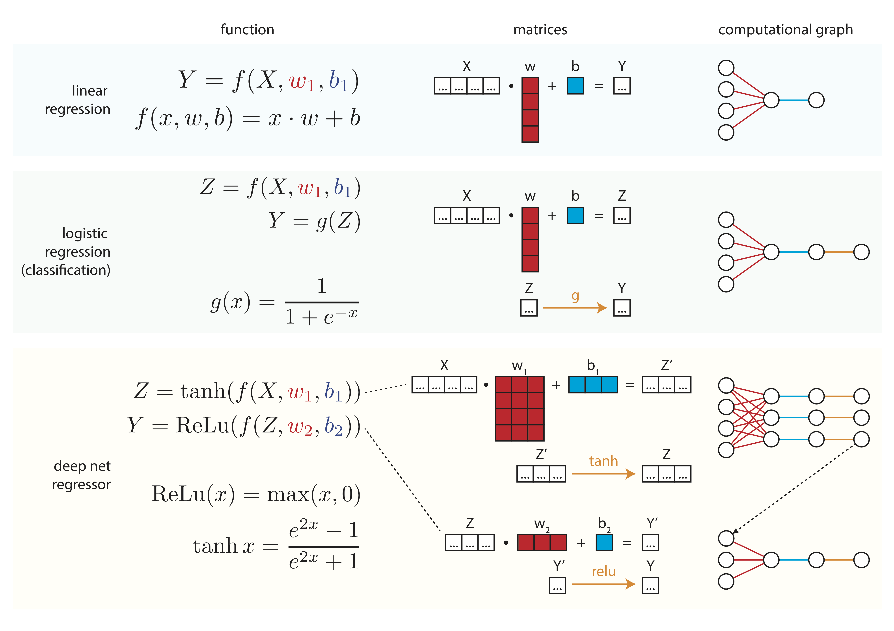

# Deep Learning Fundamentals

_Without all the jargon!_

---

## Learning Goals

Deep learning is nothing more than:
<!-- .element: class="fragment" data-fragment-index="1" -->

- Model <!-- .element: class="fragment" data-fragment-index="2" -->
- Loss <!-- .element: class="fragment" data-fragment-index="3" -->
- Optimizer <!-- .element: class="fragment" data-fragment-index="4" -->

You'll be able to provide a definition and/or examples of these.
<!-- .element: class="fragment" data-fragment-index="5" -->

---

## Structure

- Linear regression: 50%
<!-- .element: class="fragment" data-fragment-index="1" -->
- Logistic regression: 15%
<!-- .element: class="fragment" data-fragment-index="2" -->
- Feed forward neural network: 35%
<!-- .element: class="fragment" data-fragment-index="3" -->

---

## Pre-requisite Knowledge

- Linear Algebra
<!-- .element: class="fragment" data-fragment-index="1" -->
- NumPy
<!-- .element: class="fragment" data-fragment-index="2" -->
- if/else, for
<!-- .element: class="fragment" data-fragment-index="3" -->
- Lists, dictionaries, tuples and sets
<!-- .element: class="fragment" data-fragment-index="4" -->

---

## Linear Models

$$y = wx + b$$

---

- When do you use a linear model?
- What assumptions go into a linear model?

---

$$y = wx + b$$

Structural assumption: output $y$ is a weighted $w$ sum of inputs $x$ and some bias term $b$.

_When you zoom in hard enough, everything looks like a linear model._
<!-- .element class="fragment" -->

---

## Learning

> Figuring out the best parameter values, given some data.

---

## Gradient-Based Optimization

Foundation of all of deep learning

---

## Framework

1. Model: $y = f(X, \theta)$. Mapping $X$ to $y$.
2. Loss: $L(y, f(X, \theta))$. Measure how bad the model is.
3. Optimizer: Iteratively change $\theta$ to minimize loss $L$.

They are rank-ordered by how often we modify them.

---

### Model

We fiddle around with this the most. Canonically:

- CNNs: Image-type data
- RNNs: Sequential-type data

---

### Loss

- Flexible.
- Modifications:
    - Weighting
    - Additional terms

---

### Optimizer

Usually don't change. We wrote "vanilla gradient descent" in the tutorial.

- Other optimizers are available.
- "Just use Adam with step size 0.005" is folklore that "works in my hands (TM)".

---

## Models

 <!-- .element height="70%" width="70%" -->

---

Newsletter: https://tinyletter.com/ericmjl

---

Website: https://ericmjl.github.io/
